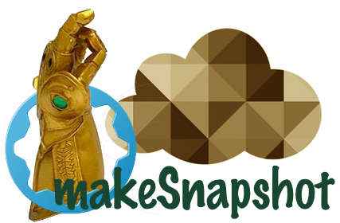

# makeSnapshot



makeSnapshot is a CLI tool to create a snapshot of a virtual machine on the KPN vRA platform.
Restricted by a platform policy only one snapshot per VM is allowed. The default behaviour is to overwrite the existing snapshot.

The main goal to build this app was that it enables the full automation of software deployment on a tenant environment. We normally create a snapshot of a VM before upgrading software.
Before we had to go into the vRA portal to create a snapshot manually, now we can incorporate the "snapshotting" in an automated workflow.

## vRA API's

Several API calls are needed to creates a snapshot of the virtual machine. I wrote a blogpost [Creating a snapshot via the vRA API](https://tisgoud.nl/creating-a-snapshot-via-the-vra-api/) describing the different vRA API-calls.

## Config file

A yaml configuration file is used to store some required parameters like the baseURL, name of the tenant, login domain, and credentials. The default configuration file (makeSnapshot.yaml) is stored in the application directory.
The content of a sample config file:

```yaml
---
baseURL: "https://base-platformURL"
tenant: "tenantName"
domain: "login domain"
userName: "userName"
password: "password"
...
```

You can create the yaml config file based on this sample or generate it through the 'generateConfig' command.

Create the default config file: `$ makeSnapshot generateConfig`

Create a non-default config file: `$ makeSnapshot generateConfig -s ~/myconfigfile.yaml`

## CLI flags

The command line options can be used in the shorthand form `-c [value]` or `-c=[value]`.

### -c or --config

Load a different configuration file, different name, different location.

Optional flag. In addition a string value has to be provided.

### -d or --domain

The 'domain' flag overrides the login domain provided in the config file.

_Optional flag._

### -r or --dry-run

The 'dry-run' flags enable you to run the application against your environment testing the configuration without making the actual request for a snapshot.

_Optional flag._

### -h or --help

Help for makeSnapshot application.

_Optional flag._

### -k or --keepExisting

Only one snapshot is allowed due to a platform policy. The default behaviour is to overwrite the existing snapshot. The 'keepExisting' flag makes sure that the existing snapshot is not overwritten.

When a snapshot exists and the 'keepExisting' flag is used the application will fail with a status code 1. This can be used to test the fail scenario in a workflow.

_Optional flag._

### -m or --machineName

The 'machineName' is a required flag, it expects an additional case-sensitive string as input parameter. The 'machineName' is the name of the virtual machine to snapshot.
Take note that in the vRA portal the name will be shown with a three letter prefix (tenant specific prefix), this prefix is ignored in the search.

_Mandatory flag. In addition a case-sensitive string value has to be provided._

### -t or --trace

The 'trace' flag provides information on the different steps of the application. These different steps are described in my blogpost [Creating a snapshot via the vRA API](https://tisgoud.nl/creating-a-snapshot-via-the-vra-api/).

_Optional flag._

### --version

Display the version of the application.

_Optional flag._

## Running the app

THe application interacts with vRA by calling the vRA APIs. The first API calls are merely initialization, once the request is send to create the snapshot vRA processes the request. The request is send from from vRA to vRO to vCenter etc. The processing time is depending on the load of the system but usually takes about half-a-minute.

The status of the request is checked every 10 seconds until the status is 'succesfull' or 'failed'.

When the status is succesfull the snapshot is created and the exit status code will be 0.
In case of a failure the snapshot is not created and the exit status code is 1 or higher.

The exit status code is not displayed when running the aplication from the commandline but can be checked right after the applicastion has run with the following command `echo $?`.

Jenkins takes notion of the status code.

## Go(lang)

The software was written in Go, the language with the cute Gopher logo.

Being it a CLI-tool I used the combination of [Cobra](https://github.com/spf13/cobra) and [Viper](https://github.com/spf13/viper) to handle the commandline parameters and the configuration file.

## Build

The software is developed on a Mac. The Linux version was created with the following command:

`env GOOS=linux GOARCH=386 go build .`

## DISCLAIMER

THE SOFTWARE IS PROVIDED "AS IS", WITHOUT WARRANTY OF ANY KIND, EXPRESS OR
IMPLIED, INCLUDING BUT NOT LIMITED TO THE WARRANTIES OF MERCHANTABILITY,
FITNESS FOR A PARTICULAR PURPOSE AND NONINFRINGEMENT. IN NO EVENT SHALL THE
AUTHORS OR COPYRIGHT HOLDERS BE LIABLE FOR ANY CLAIM, DAMAGES OR OTHER
LIABILITY, WHETHER IN AN ACTION OF CONTRACT, TORT OR OTHERWISE, ARISING FROM,
OUT OF OR IN CONNECTION WITH THE SOFTWARE OR THE USE OR OTHER DEALINGS IN
THE SOFTWARE.